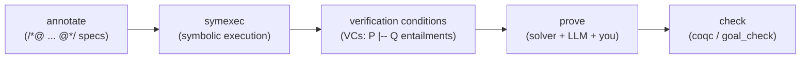

# What QCP is — and the one promise

You already test, fuzz, and review your C. Those tools sample behavior: they run the code on some inputs and look for failures. **QCP (Qualified C Programming)** does something different — it **proves** that a function meets its specification for *all* inputs in scope, by reducing the code to separation-logic verification conditions, letting a strategy solver discharge many of them automatically, and checking the rest as manual `Qed` proofs in the Coq/Rocq proof assistant. Where a test says "no failure on the cases I tried," a QCP proof says "no failure, by construction, against the spec I wrote." (That split — solver-discharged versus kernel-checked — is QCP's two-tier trust model; [ch 10](ch10-trust-and-soundness.md) is where it gets its weight.)

That difference is the whole point — and so is its cost. This chapter gives you the mental model: the one promise QCP makes, the price that promise carries, the pipeline that delivers it, and the three ways you'll drive it. It does **not** re-teach separation logic; when you need the mechanics of `**` or how a Hoare triple is derived, the [tutorials](../tutorial/) and [qua.codes](https://qua.codes) own that. This manual is the judgment layer on top.

## The one promise

> **You write WHAT the code does.** A `Require`/`Ensure` spec, plus ready-made ownership predicates (`sll`, `store(...)`, `IntArray::full`, …). **The WHY — loop invariants and proofs — is largely delegated:** the strategy solver discharges the routine obligations automatically, and (with the AI dial up) an LLM drafts the loop invariants and the remaining proofs, which you review to the depth your situation demands. You descend into deep separation logic only when you need a predicate the library doesn't already have.

Hold onto the spine metaphor: **you own the WHAT; you delegate (and review) the WHY.** Be precise about agency. A **loop invariant** — the property that holds on every iteration — is an annotation *someone writes* (you, or the LLM you direct), **not** something the tool invents. `symexec` turns your annotated code into the proof obligations; the solver, the LLM, and you close them.

### The promise travels with a tax

The promise is real, but it is not "no effort." The honest counterweight: on the current corpus snapshot, **roughly a quarter to a third of proof effort is still manual on average** — automation carries the majority, but a real minority lands on you (or the LLM you supervise and then check). Treat that range as a measured snapshot, not a constant: the example tree is a regenerated artifact whose counts drift, and the exact figure depends on what you count. And there is one tax you pay *every time*: in the proof logic, a C `int` is modeled as `Z`, an **unbounded mathematical integer**, so **every integer result costs a manual range/overflow bound**. There is no overflow automation. The promise and the tax always travel together — see [ch 12](ch12-scope-and-scaling.md) for the calibration, the counting commands, and how it was measured.

## What QCP proves — and what it doesn't

Verification has a sharp boundary, and naming it early saves disappointment later. QCP proves that **your code satisfies the spec you wrote** — in separation logic, so pointers, the heap, and aliasing are handled rigorously. It does **not** prove that your spec says what you *meant*; a wrong `Require`/`Ensure` is faithfully "verified." Nor does a green build mean every obligation was re-checked by the kernel — QCP's trust is **two-tier**, and the trustworthy unit is a single `Qed`, not a file or a build. That distinction is load-bearing enough to get its own chapter: read [ch 10 — Trust & soundness](ch10-trust-and-soundness.md) before you call a verified function "done."

## The pipeline at a glance

Five steps take annotated C to a checked result. This is the *glance*; the depth lives in Part III — [ch 6](ch06-annotations-as-specs.md) (annotations), [ch 8](ch08-separation-logic-memory-model.md) (SL & memory model), and [ch 9](ch09-goals-symexec-and-proof.md) (goals & symexec).



1. **Annotate.** Add ownership predicates and a function spec (`With` / `Require` / `Ensure`), plus in-body `Assert` and loop `Inv` annotations, inside `/*@ ... @*/` comments in your `.c` file.
2. **Symbolically execute.** Run the `symexec` binary. It walks the program statement by statement and reduces correctness to a set of separation-logic entailments `P |-- Q` — the **verification conditions** (VCs).
3. **Auto-solve.** A user-extensible strategy engine discharges the routine VCs automatically.
4. **Prove the rest.** The remaining VCs need a human or LLM to write a Coq proof.
5. **Check.** `coqc` compiles the proofs against the `SeparationLogic/` library; a `goal_check` module confirms every VC is accounted for.

For an ordinary example case, `symexec` emits **four files** into the parallel `SeparationLogic/examples/` tree — a goal file, two proof files, and a completeness gate; the only one you edit is `<name>_proof_manual.v`. (The standard-library inputs under `QCP_examples/stdlib/` are the one exception — their artifacts land in `SeparationLogic/stdlib/` under the `SimpleC.StdLib` namespace, not under `examples/`.) The file taxonomy, witness numbering, the never-overwrite behavior, and the proof loop are [ch 9](ch09-goals-symexec-and-proof.md)'s subject.

## The first false friend: `*` is separating conjunction, not multiply

You'll hit this on your first annotation, so internalize it now.

> **`*` in an annotation is separating conjunction, not C multiplication and not logical "and."** It joins two memory regions and asserts they are **disjoint**. Pure, heap-independent facts join with `&&`. Spatial facts join with `*`.

A clear specimen (using the typed int-storage form `data_at(p, int, v)` from [tutorial T2](../tutorial/T2-pre-post-condition.md)):

```c
exists v, v >= 0 && data_at(p, int, v) * data_at(q, int, v)
//          └─ pure (&&): v ≥ 0 ─┘        └─ spatial (*): p and q are DISJOINT cells, same value ─┘
```

Read `*` as "and, in separate memory." The full treatment — every operator, every predicate family — lives in the [bestiary](reference/BESTIARY.md); the separation-logic intuition behind it is [ch 8](ch08-separation-logic-memory-model.md).

## Three surfaces: how you'll drive QCP

QCP is one engine behind three front ends. Pick by task, not by preference.

| Surface | What it is | Use it when |
|---|---|---|
| **CLI** | `symexec` / `StrategyCheck` directly, or `run-example-linux.sh` for batch runs | scripting, CI, batch regeneration of the corpus |
| **QIDE** | a VS Code extension (`qide.vsix`) driving the `lsp` binary | writing annotations — `Alt+→` "interpret to point" shows the live symbolic state at your cursor |
| **MCP** | servers (`qcp-mcp`, `rocq-mcp`) that expose QCP to LLM agents | delegating annotation, VC checking, and proof drafting to an AI |

The CLI and QIDE are **battle-tested**. The MCP/AI surface is partly **intended-workflow**: it needs a frontier model today, carries real setup friction, and has Windows gaps — [ch 7](ch07-invariants-and-the-ai-dial.md) covers it honestly, with the friction named.

The surface you pick is *how* you drive QCP; the next axis is *how deep* you go.

## Three tiers and one dial

Practitioners use QCP at three depths. These are an **overlay on one shared workflow**, not separate tracks — the body of this manual is written tier-agnostically, and a tier callout appears only where the right action genuinely differs.

| Tier | Who | Mode | Relationship to Coq |
|---|---|---|---|
| 🟢 **Tier 1** | C programmer, no Coq | autopilot | never reads Coq; writes specs, lets auto-solve + the LLM close proofs |
| 🔵 **Tier 2** | C programmer who reads Coq | co-pilot | reads and fixes the manual proofs the LLM drafts |
| 🟣 **Tier 3** | separation-logic / Coq expert | tactical director | writes new predicates and `.strategies`, extends the library |

**AI is a dial, not a fourth tier.** Every tier turns delegation up or down — there is no separate "AI user." A tier-1 practitioner runs the dial high (the LLM drafts invariants and proofs; they review the green check). A tier-3 expert often runs it low for the parts they want to control by hand. When this manual says "dial up," it means *more delegation*; "dial down" means *more by-hand control*.

## One more boundary before you start

Some C is flatly out of scope: **floats and doubles, `goto`, function pointers / indirect calls, and shared-memory concurrency are unsupported**. How they fail differs — some loudly, some silently — and that difference matters in practice. [Ch 3 — Scope at a glance](ch03-scope-at-a-glance.md) has the full matrix with per-feature evidence and the loud-versus-silent failure modes; check it before you point QCP at code that uses any of the four.

## Where to go next

You now have the model: QCP **proves** rather than tests; you write the **WHAT** and delegate the **WHY**; that carries the manual-effort tax plus a per-integer overflow bound; the work flows annotate → symexec → VCs → prove → check; and you drive it from the CLI, QIDE, or MCP at one of three tiers with the AI dial wherever you want it.

From here:

- **Deciding whether to adopt QCP?** [Ch 2 — Should you use QCP?](ch02-should-you-use-qcp.md)
- **Is your code in scope?** [Ch 3 — Scope at a glance](ch03-scope-at-a-glance.md)
- **Want to run something now?** [Ch 4 — Quickstart](ch04-quickstart-stage-a.md), starting from `QCP_examples/QCP_demos_human/simple_arith/abs.c`.
- **What does the green check really mean?** [Ch 10 — Trust & soundness](ch10-trust-and-soundness.md).
- **New to separation logic?** Start with the [tutorials](../tutorial/) — this manual assumes, rather than teaches, the mechanics.
