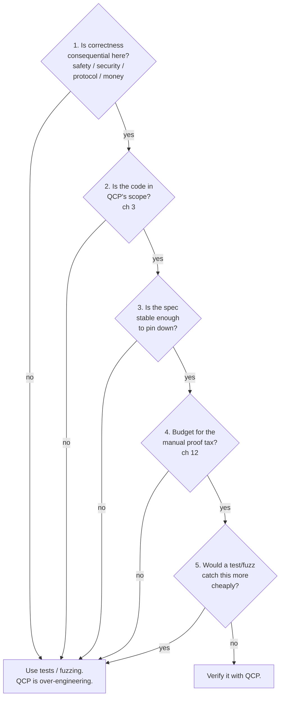

# Should you use QCP?

QCP is not free, and it is not for every function. This chapter is a go/no-go aid: when QCP earns its keep over tests, fuzzing, and review, what a green check actually buys you, and a five-question rubric for "is it worth it for *my* code?" Read [ch 1](ch01-what-qcp-is.md) first if you don't yet have the shape of the tool; read this before you commit a sprint to it.

The short version: QCP pays off when correctness is **consequential**, the code is **in scope**, and the spec is **stable** enough to pin down — and you can afford the manual proof tax that rides along with every adoption. If those don't hold, a test or a fuzzer is the cheaper tool, and reaching for QCP is over-engineering.

## What verification buys that testing can't

A test or a fuzzer checks the inputs you (or the fuzzer's heuristics) actually run. A QCP proof checks **all** inputs in the model at once. That difference is the whole value proposition, and it cuts both ways.

| Question | Tests / fuzzing | QCP proof |
|---|---|---|
| Coverage | the inputs you exercise | all inputs in the model — no counterexample exists |
| Catches | bugs on the paths you hit | the absence of a class of bug (for the spec you wrote) |
| Memory safety | only where a sanitizer trips | proved structurally (separation logic tracks aliasing) |
| Cost shape | cheap to start, weak tail-coverage | high fixed cost, then exhaustive |
| Fails when… | a path is untested | the property is false **or** unprovable in scope |

Verification's unique product is the **negative result**: after a green proof, there is no input — in QCP's model of C — that violates the spec you wrote. Testing can never give you that; it can only fail to find a counterexample. So QCP shines exactly where "we tested it a lot" isn't good enough: a memory-safety invariant on a parser fed hostile input, an arithmetic routine that must never overflow, a data-structure operation whose correctness the rest of a system *assumes*.

But read that product precisely. The proof is about QCP's **model** of your C, against the **spec you wrote** — not your intent, and not the silicon. A wrong `Require`/`Ensure` is faithfully "verified." And a green build is not uniformly kernel-checked; it is **two-tier**, which the next section pins down. QCP and testing are complements, not substitutes: tests still catch the spec that says the wrong thing, the build-system mistake, the integration bug across an unverified boundary.

## The trust teaser: what a green check means

A QCP "✔" is **two-tier**. The **manual** fraction — the **verification conditions** (the per-step proof obligations `symexec` emits) a human or the LLM proves — ends in `Qed` and is **kernel-checked** by Coq/Rocq, term by term; a `Qed` on a false verification condition is impossible, absent an unsound axiom. The **auto** fraction — the conditions `symexec`'s strategy solver discharges — ends in `Admitted` and is **trusted, not re-checked**. The auto pool is the larger one (more on the ratio below), so a green build is a **completeness gate** — every verification condition is present, the manual fraction kernel-checked and the auto fraction trusted — **not** end-to-end re-checking. The trustworthy unit is a `Qed`, not a green build and not a file; don't read a green `goal_check` as "kernel-checked end to end." Whether that's good enough for your code depends on how much of your result is auto vs. manual and what's in your trusted base — the full audit recipes (`grep -c Admitted/Qed`, `Print Assumptions`), the trusted computing base, and the faithfulness gap are [ch 10](ch10-trust-and-soundness.md). Read it before you call a verified function "done."

## The cost you're signing up for

QCP delegates most of the proof work and keeps a real minority for you. The honest framing: **you write WHAT the code does** (the spec, plus ready-made ownership predicates); **the WHY** — loop invariants and the routine proof obligations — **is largely delegated** to the strategy solver and, with the AI dial up, the LLM. You descend into separation logic by hand only for the parts the automation can't close.

The counterweight is the **manual proof tax**. Measured over the shipped example corpus, **roughly a quarter to a third of proof effort is still manual** on average. A command-based snapshot — `grep -rh Admitted … --include="*_proof_auto.v" | wc -l` against `grep -rh Qed … --include="*_proof_manual*.v" | wc -l`, from `SeparationLogic/examples` — gives ≈ 2.5–3 auto `Admitted` lemmas per manual `Qed`, depending on shard scope. Read that as a **proof-effort proxy, not a VC count**: raw `Qed` also counts helper lemmas, so it over-counts manual VCs. The example proofs are regenerated artifacts, so the numbers drift — re-run before you quote one; full commands and methodology are in [ch 12](ch12-scope-and-scaling.md). The skew is real but qualitative: more manual work for arithmetic, number-theory, and OS code; much less for array/string/list code that reuses shipped predicates.

One cost is not optional and not automated: **every `Z` arithmetic result needs a manual range/overflow bound.** QCP models integers as `Z`, the **unbounded mathematical integer**, not fixed-width `int`. There is no overflow automation, so each arithmetic verification condition carries a hand-written bound. This is why even the simplest shipped example, `QCP_examples/QCP_demos_human/simple_arith/abs.c`, opens by re-imposing C's limits with `INT_MIN < x && x <= INT_MAX`. If your candidate code is arithmetic-heavy, budget for this per result.

> **Honest limit:** "largely delegated" is not "no effort." The promise and the tax always travel together: you own the WHAT, you delegate (and review) the WHY, and you still pay the manual tax by hand — plus a manual bound on every integer result.

The AI dial sets how much of that manual fraction *you* personally write versus review. Tier-1 practitioners (C programmers who don't read Coq) run the dial high, letting the LLM draft invariants and proofs and reviewing the outcome at the depth they need. Tier-3 experts often run it low, writing the hard proofs and new predicates themselves. The tax doesn't disappear when you dial up — it shifts from *authoring* to *reviewing* — and how much you can dial up depends on your tier and on the maturity caveats around the AI workflow (frontier-model-required today, setup friction; see [ch 7](ch07-invariants-and-the-ai-dial.md)).

## Is it worth it for *my* code? A five-question rubric

Walk these in order. The first **no** is usually your answer.

The go/no-go decision flow — the first *no* points you to a lighter tool:

1. **Is correctness consequential here?** QCP's exhaustive guarantee is worth its cost when a bug is expensive — memory-safety on untrusted input, a security or protocol invariant, financial arithmetic, a data-structure contract the rest of the system relies on. If a bug here is a minor annoyance, the proof tax isn't justified; test it.

2. **Is the code in QCP's supported scope?** QCP covers a real but bounded slice of C — integers, pointers, structs, arrays (its strongest), strings, recursion, and the full structured control flow you already write. It does **not** support floats/doubles, `goto`, function pointers, or shared-memory concurrency. One trap to know before you commit: a float program *looks* like it passes (`symexec` exits 0) but leaves an obligation that can never be discharged — apparent success, no proof. If your code centers on any unsupported feature, stop here. Full matrix and the four distinct failure modes: [ch 3](ch03-scope-at-a-glance.md).

3. **Is the spec stable enough to be worth pinning down?** A proof is a contract carved into the code. If the behavior is still in flux — an exploratory prototype, a spec that changes weekly — you'll re-prove on every churn, and the tax compounds. Verify code whose *intended* behavior has settled, even if the implementation hasn't.

4. **Budget for the manual tax?** A real minority of the proof is hand-written (the snapshot number and methodology are in the cost section above), plus a bound per integer result. If your team can't read or review Coq and can't lean on the AI dial — which moves work from authoring to reviewing but doesn't erase it (see above and [ch 7](ch07-invariants-and-the-ai-dial.md)) — account for it: [ch 12](ch12-scope-and-scaling.md).

5. **Would a test or fuzzer catch this more cheaply?** The honest tie-breaker (the "what verification buys" section above). If a property test or a few hours of fuzzing covers the failure mode, that's the cheaper tool — use it. Reserve QCP for what testing *structurally* can't reach: the absence of a whole class of error across all inputs.

Five yeses (with a "no" on the cheaper-tool question) is a strong signal to verify. A no anywhere earlier is a signal to reach for a lighter tool — and that's a feature, not a failure: knowing when *not* to use QCP is part of using it well.

## Where to go next

- **Can QCP even handle code like mine?** → [ch 3 — Scope at a glance](ch03-scope-at-a-glance.md), with the full support matrix and the "not supported" box.
- **What does the green check really mean, and how do I audit it?** → [ch 10 — Trust & soundness](ch10-trust-and-soundness.md).
- **What does the manual tax actually cost, with numbers and methodology?** → [ch 12 — Scope & scaling](ch12-scope-and-scaling.md).
- **How do I drive the AI dial?** → [ch 7 — Invariants & the AI dial](ch07-invariants-and-the-ai-dial.md).
- **Ready to try it without AI setup?** → [ch 4 — Quickstart](ch04-quickstart-stage-a.md).
