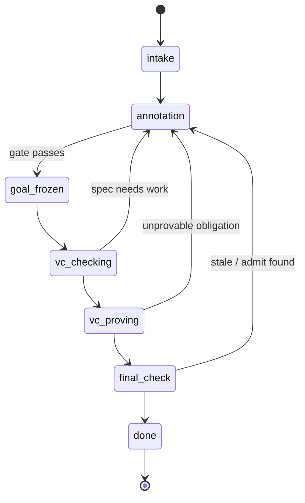

# Invariants & the AI dial

You **own WHAT** the code does — a `Require`/`Ensure` spec, plus the ownership predicates the library already gives you. You **delegate the WHY** — the loop invariants and the proofs that justify them. This chapter is about *to whom* you delegate the WHY, and how far: `symexec`'s strategy solver discharges the routine obligations, and the **LLM** drafts the loop invariants and the remaining proofs. How much you hand to the LLM versus keep by hand is the **AI dial** — and the dial, not your tier, is what you actually turn day to day.

"Own," not "write," is deliberate. The LLM can *draft* the spec for you too — the annotation skills do exactly that. But the spec is the one artifact you must **review against your intent**, because QCP proves *the spec you gave it*, not the behavior you meant: a wrong `Require`/`Ensure` is faithfully "verified" ([ch 10](ch10-trust-and-soundness.md)). **That review is the irreducible human step** — the genuine place human judgment is required, whether you wrote the spec or the LLM did. So the dial below governs how far you delegate the **WHY**; the **WHAT still needs your eyes**, dial up or down.

Read [ch 4](ch04-quickstart-stage-a.md) first: it gets a shipped example to a green `goal_check` with **no AI at all** (Stage A — the core verifier). This chapter is **Stage B** — adding the Model Context Protocol (MCP) servers and the agent workflow so an LLM can carry the invariants and proofs for you. Stage B is **optional**. The day-0 win does not require it.

> **Note (maturity):** the CLI / `symexec` / `coqc` core (Stage A) is **battle-tested**. The MCP/AI layer in this chapter is **largely intended-workflow**: it is designed and shipped, but it carries real friction (frontier-model requirement, setup cost, Windows gaps, a Chinese contract file). Stage B is optional — budget for the setup and model friction, and validate the workflow on a known-good case before relying on it. The friction is laid out in full at ["When the tooling crashes"](#when-the-tooling-crashes-not-when-the-proof-is-stuck) below. Where a claim here is intended-workflow rather than corpus-proven, it is marked.

## Invariants are the WHY you delegate

A loop invariant is the single hardest annotation to write, and the clearest case of the WHAT/WHY split: the loop body is *your* WHAT; the invariant that proves the body correct is the *WHY*. Here is the fact that determines who can write it.

**`symexec` does not invent loop invariants for you. It checks the one you supply.** It won't study the loop and discover the right invariant on its own — give it a loop with no invariant and it stops and asks for one. It *does* help once an invariant is provided: a **Partial Invariant Solve** step mechanically fills the easy, frame-shaped parts of the assertion, so what you supply is usually the essential *logical* part rather than the whole thing. But that load-bearing content is **someone's** to write — you (dial down) or the LLM you direct (dial up). "QCP writes the invariant for you" is **false**; it checks, and partial-solves, the one you provide.

🟣 How `symexec` checks the invariant you supply

The engine verifies a supplied invariant two ways (classic Hoare inductive checking): **P → I** (the invariant holds when you first reach the loop) and **I → I** (it survives one iteration). A failure on either prints a distinct diagnostic. The full mechanics — symbolic execution, witnesses, the VC set — are [ch 9](ch09-goals-symexec-and-proof.md)'s; writing your first `Inv` for a loop is [ch 5](ch05-your-first-spec.md)'s; the annotation surface is [ch 6](ch06-annotations-as-specs.md)'s.

That is the whole motivation for the dial. Because the invariant is delegated-but-authored, the practical question is never "will the tool figure it out" — it won't — but "do I write it, or does the LLM?"

You write an invariant in ordinary annotation syntax with `Inv` / `Inv Assert`. A real loop-bearing example you can open is `QCP_examples/QCP_demos_LLM/sum.c` (`Inv Assert`-annotated). The annotation surface itself is [ch 6](ch06-annotations-as-specs.md); writing your first `Inv` for a loop is in [ch 5](ch05-your-first-spec.md). This chapter assumes you can read one and asks who *produces* it.

## The AI dial: not a tier

QCP is used at three depths — 🟢 tier 1 (autopilot, never reads Rocq), 🔵 tier 2 (co-pilot, reads and fixes proofs), 🟣 tier 3 (tactical director, writes predicates and strategies). The dial is **orthogonal** to all three. Every tier turns delegation up or down; "AI user" is not a fourth persona.

| Dial position | What the LLM does | What you do | Typical tier |
|---|---|---|---|
| **Up** | Drafts the **spec**, the loop invariants, and the manual VC proofs | **Own the spec** — review the LLM's `Require`/`Ensure` against your intent (the irreducible step); review the rest to your tier's depth | 🟢 runs the dial high — review at the C/spec level |
| **Middle** | Drafts proofs for the obligations you point it at; you steer which | Write or review the spec; write the invariants; hand specific stuck **verification conditions (VCs)** to the LLM | 🔵 — read the drafted proof, fix the range bound it missed |
| **Down** | Little or nothing; you drive the proof by hand | Write the spec, invariants, and proofs; reach for the LLM only when stuck | 🟣 — often low for the parts you want to control |

A **verification condition (VC)** is the entailment `P |-- Q` that `symexec` emits for one step of your annotated code; QCP splits them into the auto fraction the solver discharges and the manual fraction that needs a written Rocq proof (the trust model that turns on this split: [ch 10](ch10-trust-and-soundness.md)).

The reason the dial matters more than the tier: the **manual fraction of proof effort is real but a minority** — roughly a quarter to a third of *proof effort* lands on the manual path rather than the solver's auto-discharge (a regenerated-corpus snapshot, command-backed; [ch 12](ch12-scope-and-scaling.md) carries the calibration and methodology). "Manual" here means *needs-a-written-Rocq-proof*, **not** *a human must type it*. With the dial up, the LLM drafts most of that manual fraction; your hands-on proving burden is materially smaller than that figure suggests. It is smallest for array/string/list code that reuses shipped predicates and larger for arithmetic and OS code.

> **Honest limit:** there is **no verified LLM success rate** for closing manual VCs. The corpus ships an `LLM_bench` suite, but no audited "the LLM closes X% of obligations" number exists here. Treat the dial-up promise as qualitative, and pair it with the frontier-model caveat below. Don't quote a percentage.

And every `Z` arithmetic result still costs you a **manual range/overflow bound** — `Z` is an unbounded mathematical integer, so there is no overflow automation, dial or no dial (this is the same tax [ch 5](ch05-your-first-spec.md) introduces with `abs.c`). Turning the dial up changes *who drafts* that bound; it does not make the obligation disappear.

One concrete knob lives on `symexec` itself: the `--full-auto` flag (run `symexec --help` to confirm it on your build) enables fully automatic proof mode, pushing more of the proof onto the solver's auto-discharge before anything reaches the manual path. It is a Stage-A dial — independent of the LLM — and like every auto-discharged VC, what it closes is *trusted*, not kernel-checked ([ch 10](ch10-trust-and-soundness.md)). Use it to shrink the manual fraction; don't read its success as a stronger guarantee than auto-discharge already gives.

## Trust of an AI-drafted proof

The dial table above ends every row with "you review" — here is why that column is load-bearing. A proof the LLM wrote is trusted exactly like a proof you wrote — **no more, no less.** When an LLM-drafted proof ends in `Qed`, the Rocq kernel re-elaborates it term by term against the emitted VC and the axioms QCP imports. The kernel does not care who wrote the proof; an LLM `Qed` is **genuinely kernel-checked**. Delegating the proof does not weaken the guarantee.

There is one trap specific to delegation, and it is worth naming plainly. An LLM can make a red goal go green not by *proving* it but by **weakening the spec** — loosening a `Require`/`Ensure` or a loop invariant until the obligation becomes trivially true. The resulting `Qed` is perfectly valid and perfectly kernel-checked; it just certifies a weaker property than you meant. The kernel cannot catch this — it guards the *proof*, never the *faithfulness* of the spec to your intent. This is exactly the faithfulness gap from [ch 10](ch10-trust-and-soundness.md). In the Stuck-Goal Differential ([ch 11](ch11-stuck-goal-differential.md)) it is a **cause-1 bug** — a *wrong spec* wearing a green check — even though you reached for the dial to escape a **cause-4** automation shortfall: the fix to one cause silently introduced another. **Review what the dial produced at the level your tier demands** — the higher you turn the dial, the more this review matters, because the WHAT (your spec) is the thing the LLM should never silently change.

For the full trust model — the two tiers, the audit recipes, the TCB — see [ch 10](ch10-trust-and-soundness.md).

## Stage B setup: the two MCP servers

Two MCP servers expose QCP to an LLM agent (and to MCP-capable editors — VS Code Copilot, Claude Code, Codex). They are the machinery the dial turns:

- **`qcp-mcp` — interactive symbolic execution.** Wraps the `mcp` toolchain binary so an agent can drive `symexec` statefully while it writes annotations. This is what the **annotation phase** uses.
- **`rocq-mcp` — interactive Rocq proving.** Wraps `coqc` plus the coq-lsp `pet` engine so an agent can compile, query, and step proofs on Linux/macOS. This is what the **vc-proving phase** uses. Among its tools is `rocq_assumptions` — a `Print Assumptions` you can run from the agent, the same trust audit [ch 10](ch10-trust-and-soundness.md) teaches.

Setup, env-var resolution, Python floors, and copy-paste editor registration live in `README_LINUX.md` (the "MCP Setup" section) — install once, then drive the agent, not the tools.

> 🟢 **Tier 1** — You drive the agent, not these tools directly. You need them *installed and registered* so the agent can call them; you won't invoke `step` or `rocq_compile` yourself.

> **Honest limit (Windows):** the Windows Rocq 8.20 build ships `vscoqtop.exe` but **not** `coq-lsp`/`pet`, so `rocq-mcp`'s interactive proving is unavailable there — the recommended Windows proof path is direct `coqc.exe`/`coqtop.exe` with VsCoq in the editor. `qcp-mcp` (symbolic execution) still works on Windows. One referenced setup helper, `scripts/setup-windows-mcp-env.ps1`, is **not shipped** in this snapshot — set `QCP_MCP_BIN` by hand.

## The agent workflow: a phase state machine

Above the two servers sits the **agent workflow** — the contract for taking a C file from unverified to compiled proof with an LLM. It is **one main orchestrator agent** plus **fixed sub-agents**, run as a phase state machine. The phases map cleanly onto the WHAT/WHY split and onto the dial — one phase drafts the invariants, another proves the VCs:

*The agent workflow's phase state machine: forward through the phases, looping back to `annotation` whenever a downstream phase exposes a too-weak spec or an unprovable obligation. The prose and table below use the canonical hyphenated phase names.*

| Phase | Owner | Role in the dial |
|---|---|---|
| **intake** | main | Lock the case. |
| **annotation** | annotation sub-agent | **Drafts the loop invariants and specs** (validated live with `qcp-mcp`). |
| **goal-frozen** | main | Runs `symexec`; freezes the witness/VC set. |
| **vc-checking** | vc-checking sub-agent | Triages each manual VC for proving. |
| **vc-proving** | vc-proving sub-agent | **Proves the manual VCs.** |
| **final-check** | main | Audits structure, `coqc`, `Admitted`/extra-`Axiom`. |
| **done** | main | All completion criteria met. |

The design enforces strict file ownership: sub-agents are read-only by default and write only their assigned scratch; only the **main agent** writes the case's master-state files and runs `symexec`/`coqc`. The completion criteria include the trust-relevant gate — **no `Admitted` or extra `Axiom` in the manual file or case lib** ([ch 10](ch10-trust-and-soundness.md)'s one real watch-item, enforced as a `done` condition). The full contract — the per-phase detail and the skills it dispatches — lives in the shipped `AGENTS.md`.

> **Honest limit:** `AGENTS.md` being Chinese is a real onboarding tax for an English-speaking operator — budget time to work through it (machine translation handles the bulk), since it is the authoritative contract for the agent workflow.

## When the tooling crashes (not when the proof is stuck) {#when-the-tooling-crashes-not-when-the-proof-is-stuck}

Two failure modes look alike from the outside and need opposite fixes. Keep them separate.

- A **proof failure** is a red Rocq goal you (or the LLM) can't close. That routes to the [Stuck-Goal Differential (ch 11)](ch11-stuck-goal-differential.md) — and when the LLM specifically came up short on a provable, in-scope obligation, that is **ch 11 cause 4** (dial the AI harder, add a `.strategies` rule, or prove it by hand).
- An **infrastructure failure** is the *tooling itself* crashing before it gets to a proof — a Python traceback, a `NameError`, a "before worker launch" abort. That is a software bug in the pipeline, not a stuck goal, and it routes to [ch 13](ch13-honest-limits.md) / [R5](reference/TROUBLESHOOTING.md).

The shipped agent scripts are intended-workflow and can fail as software — e.g. a known `vc-proving` `NameError` that can leave `Admitted` stubs in `*_proof_manual.v` and so masquerade as "N unproven obligations" rather than a tool fault. The details, the self-check recipe (`pyflakes` for undefined-name bugs; a `grep` for leftover `Admitted`), and the fix are in [ch 13](ch13-honest-limits.md) / [R5](reference/TROUBLESHOOTING.md).

There is a third outcome between "finished" and "crashed," and it is the one that bites: **the tool can exit 0 and *say* it finished while leaving a hole behind.** A `$?` of `0` is **not** proof of success — `symexec` returns 0 on a malformed/truncated parse, and a float program returns 0 with `"Successfully finished"` while emitting verification conditions the shipped Rocq layer can't discharge ([ch 13](ch13-honest-limits.md), FACTS §F2.1a). So after a run, don't trust the exit code: scan the tool output for warnings, and confirm the case actually compiles by building its `*_goal_check.v`. After **any** run, the question to answer is: did the tool finish *and* leave a compilable, hole-free result — or did it crash, or exit 0 over a silent gap? That audit is exactly why [ch 10](ch10-trust-and-soundness.md) makes a manual-file `Admitted` the one thing worth actively auditing.

> **Honest limit (frontier model required).** The dial-up workflow needs a frontier model today. Weaker models do not reliably draft invariants or close manual VCs, and there is no verified success rate to set expectations by (above). Budget for the strongest model you have access to, and expect to review.

## What to take away

- **`symexec` checks invariants; it does not infer them.** Someone writes the load-bearing pure part — you (dial down) or the LLM (dial up). Partial Invariant Solve fills the frame-shaped rest.
- **AI is a dial, not a tier.** Every tier (🟢🔵🟣) turns delegation up or down. Dial up and the LLM drafts invariants and the manual proofs; you review to your tier's depth.
- **An LLM proof that ends in `Qed` is kernel-checked against the emitted VC and imported axioms** — but an LLM can "fix" a goal by weakening the spec. Review the WHAT; the kernel only guards the WHY. Full trust story: [ch 10](ch10-trust-and-soundness.md). Stuck AI: [ch 11](ch11-stuck-goal-differential.md) cause 4.
- **Stage B is optional setup:** `qcp-mcp` (symbolic execution) + `rocq-mcp` (Rocq proving), driven by the agent phase machine (`intake → annotation → goal-frozen → vc-checking → vc-proving → final-check → done`).
- **Budget for the friction honestly:** frontier model required, real setup cost, `rocq-mcp` interactive proving unavailable on Windows, `AGENTS.md` in Chinese, and shipped agent scripts that can crash (a patchable `vc-proving` glitch among them). Stage B is optional and largely intended-workflow — validate it on a known-good case before relying on it, and don't trust a `0` exit code as proof of success.
