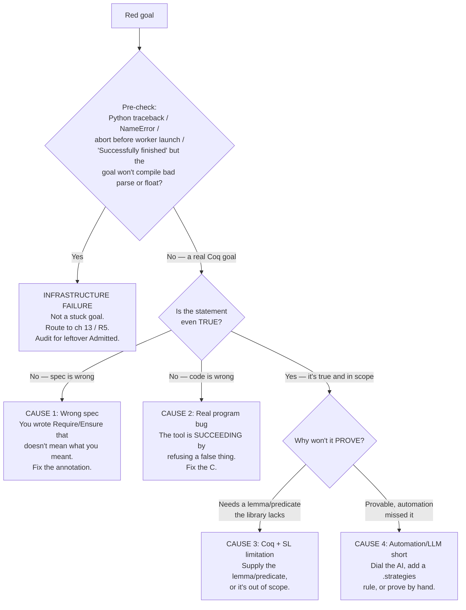

# The Stuck-Goal Differential

A red goal is a question, not a verdict. The question is **whose fault** — and the answer is almost never "QCP is broken." It is one of four things, and the first one to rule out — because it is the cheapest to check and the most actionable when it hits — is that QCP told you the truth: your code or your spec is wrong, and the tool refused to prove a false statement.

This chapter is a differential diagnosis. You will learn to route a red result to its actual cause in a fixed order — cheapest, most likely, and most actionable first — and to know what to *do* about each. It is the deliberate **mirror** of [ch 10 — Trust & soundness](ch10-trust-and-soundness.md): that chapter asks *"green — why believe it?"*; this one asks *"red — whose fault?"*

> **The one habit to carry out of this chapter:** ask *"is it even true?"* before *"why won't it prove?"* A stuck goal may be a statement that *cannot* be proved because it is false — a wrong spec or a real bug — and not a proof problem at all. Triage that possibility first; it is the cheapest to check and the most actionable when it hits.

## Pre-check: did the tool even run?

Before the differential, one gate. **A crash in the tooling is not a red goal.** It is a different kind of failure with a different fix path, and if you feed it into the differential below you will waste hours hunting a proof that was never the problem.

QCP's **CLI core** — `symexec`, `StrategyCheck`, `coqc` — is battle-tested. The **LLM agent-workflow scripts** that orchestrate annotation and proving are intended-workflow Python and can fail *as software*. That is an infrastructure failure, not a stuck goal.

How to recognize it: a real stuck goal is a **Coq error about an entailment** — a tactic that fails, a goal left open, `entailer!` that won't close. An infrastructure failure is a **Python traceback or a non-Coq error**, often with the phrase "before worker launch" or "Script infrastructure failure." And the exit code is an **unreliable** signal in both directions: re-measured live at `9804a85`, no-args, a missing `--input-file`, and a missing `--program-path` all return **exit 1**, but a malformed/truncated parse and a float program both return **exit 0** ("Successfully finished") while leaving an undischargeable obligation — so `$? == 0` does *not* prove the tool succeeded. Scan the output; don't trust `$?`. The shipped scripts carry at least one infrastructure defect (the `vc-proving` skill aborts before any worker launches) — its full root cause and fix live in [ch 13 — Honest limits & roadmap](ch13-honest-limits.md) and [R5 — Troubleshooting](reference/TROUBLESHOOTING.md), not here.

You can confirm this class of bug statically, before you trust any shipped script:

```bash
python3 -m pyflakes .agents/skills/*/scripts/*.py     # or: ruff check --select F821
```

> **Warning:** A pipeline crash can *masquerade* as a stuck goal. When proving dies mid-run, the manual proofs are never filled, so the case's `*_proof_manual.v` is left with `Admitted` stubs — which looks exactly like a batch of unproven obligations when it is really one infrastructure fault. After **any** tool failure, audit for leftover admissions before you conclude anything about the proofs:
>
> ```bash
> grep -rl Admitted SeparationLogic/examples --include="*_proof_manual*.v"
> ```

If the pre-check fires — Python error, abort before worker launch, or "Successfully finished" / exit 0 on a program the Coq layer can't actually discharge (a bad parse or a float) — **stop here.** This is not a differential case. Route it to [ch 13 — Honest limits & roadmap](ch13-honest-limits.md) for the maturity context and to [R5 — Troubleshooting](reference/TROUBLESHOOTING.md) for the fix. Only once you have a genuine **Coq goal you cannot close** do you enter the differential.

## The four causes

A red goal that survives the pre-check has exactly four causes. They are not equally likely and not equally your fault, so the order you check them in matters.

| # | Cause | Whose fault | First move |
|---|---|---|---|
| 1 | **Wrong spec** — the `Require`/`Ensure` doesn't say what you meant | Yours (the author) | Re-read the spec against your intent; fix the annotation |
| 2 | **Real program bug** — the code is wrong; the tool is *succeeding* by refusing a false thing | Yours (the code) | Read the goal as a counterexample; fix the C |
| 3 | **Coq + SL limitation** — true and in scope, but needs a lemma or predicate the library lacks | The proof base / tier-2/3 territory | Supply the missing lemma or predicate; or it's out of scope (ch 13) |
| 4 | **Automation or LLM came up short** — provable and in scope, but the solver/LLM didn't find it | The automation | Dial the AI, add a `.strategies` rule, or prove it by hand |

Causes 1 and 2 are the same underlying event seen from two sides: **QCP working correctly by refusing to prove something false.** This is the insight that flips a red goal from frustrating to useful. Check them first not because they are provably the most frequent — that depends on your code and isn't measured here — but because they are the cheapest to test and the only ones where a red goal is the tool *working*. When QCP gets stuck on a true, in-scope goal (causes 3 and 4), the obstacle is on QCP's side rather than yours.

### The decision tree

Walk the tree top-down. Each branch is a question you can answer before the one below it, and the order is deliberate: truth before provability, your authorship before the tool's.



If you can't render the diagram, the prose carries it: **pre-check → "is it true?" → (spec wrong / code wrong) → "why won't it prove?" → (library gap / automation gap).** The two "is it true?" exits are causes 1 and 2; the two "why won't it prove?" exits are causes 3 and 4.

**Localize by who wrote the failing part.** A second axis cuts across the same four causes and is often the fastest way in. QCP's promise splits responsibility: *you* own the WHAT — the `Require`/`Ensure` spec — while the WHY — loop invariants and proofs — is largely delegated to the strategy solver and (with the AI dial up) to the LLM. That split is also a diagnostic map:

- **You wrote the spec.** If the red goal traces to a `Require`/`Ensure` mismatch, suspect **cause 1** first. The spec is the one artifact QCP can never check against your intent (it is item 6 of the Trusted Computing Base in [ch 10](ch10-trust-and-soundness.md)) — so a spec bug is *invisible* until a proof refuses to close around it.
- **The LLM (or you) wrote the invariant.** A loop invariant is an annotation *someone wrote*, not something `symexec` invents. If the stuck goal is at a loop boundary — the invariant doesn't hold on entry, isn't preserved by the body, or is too weak to imply the postcondition — suspect **cause 4** and reach for the dial. A wrong invariant produces a *false* VC (cause 1/2 in disguise); a too-weak invariant produces a *true but unprovable-as-stated* VC (cause 4).
- **The solver discharged it — or didn't.** If a VC you expected the strategy solver to auto-close instead landed in `*_proof_manual.v` as a stub, the automation came up short on a routine VC: **cause 4**, and a `.strategies` rule is often the durable fix.

For how `symexec` builds these goals statement-by-statement so you can read them as claims, see [ch 9 — Goals, symbolic execution & proof](ch09-goals-symexec-and-proof.md).

## What to do, by cause

### Cause 1 — wrong spec

The spec says something other than what you meant. The proof can't close because you are asking QCP to prove a falsehood you wrote down by accident.

Re-read the `Require`/`Ensure` line by line against the behavior you intend. Classic traps: a `Z` result with no range bound, so the goal demands an overflow-free guarantee your code can't give (every `Z` arithmetic result needs a manual range/overflow bound — there is no overflow automation); separating conjunction `*` where you meant ordinary conjunction `&&`, splitting a heap you meant to share; a postcondition that promises more than the body delivers. The shipped `abs` example is the canonical reminder that a correct spec must re-impose C's integer bounds on Coq's unbounded `Z`:

```c
/*@ Require
      INT_MIN < x &&
      x <= INT_MAX && emp
    Ensure
      __return == Zabs(x) && emp
 */
```

Without that `Require` bound, `abs` of `INT_MIN` overflows and the postcondition is plainly false — a stuck goal that is a spec bug, not a proof bug. Fix: edit the annotation. (Annotation surface and the `*`-vs-`&&` false friend: [ch 6 — Annotations as specs](ch06-annotations-as-specs.md) and [R1 — Bestiary](reference/BESTIARY.md).)

### Cause 2 — real program bug

The spec is right; the code doesn't satisfy it. **This is QCP doing its job.** A red goal alone does not prove the code is wrong — it can also be a library or automation gap (causes 3 and 4). But once you have *read the open goal and found it false* — the precondition genuinely cannot support the postcondition, and you can name the counterexample — then no proof should exist: the C does not meet the contract you correctly wrote.

Read the open goal as a counterexample and trace it back to the statement that produced it. Then fix the **C**, not the proof — that catch is the payoff. The classic specimen is the `*(x++)` deref bug walked end to end in the worked diagnosis below. The repair is in the source file, after which you regenerate — `symexec` never overwrites an existing `*_proof_manual.v` (the `manual proof file not updated` warning is normal), so re-read the fresh `_goal.v`, since witness numbering and hypothesis names shift on every regeneration.

> **This is the payoff, not the problem.** Causes 1 and 2 are QCP earning its keep: it caught a defect that tests might have missed. The honest framing from [ch 10](ch10-trust-and-soundness.md) cuts both ways — a green check only certifies the spec you wrote, and a red check is how that same machinery tells you the spec and the code disagree.

### Cause 3 — Coq + SL limitation

The goal is true and in scope, but the proof needs a lemma, a representation predicate, or a manual step the shipped library doesn't already give you. This is tier-2/3 territory.

The test that separates cause 3 from cause 4: would the proof go through if you handed the solver **one more lemma** or unfolded **one more predicate**? If that lemma or predicate already exists and the search missed it, it is an automation gap (cause 4). If the lemma or predicate **doesn't exist yet** — or the feature is off QCP's map entirely — it is a limitation (cause 3).

First, confirm it is genuinely in scope and not a hard boundary masquerading as a missing lemma. **Floats and doubles, `goto`, function pointers / indirect calls, and shared-memory concurrency are unsupported** — and they fail in revealingly different ways. A function-pointer call fails *loudly* in verification mode (`fatal error: FindFuncInfo`, exit 1) — a tool-level failure to handle like the pre-check, not a stuck goal. Floats are the dangerous case: the engine *accepts* a float program, reports success at **exit 0**, and emits real IEEE VCs — but the shipped Coq layer defines none of the float symbols, so the generated goal references undefined symbols and **can't compile or be discharged at all**. (This is exactly why the exit code is unreliable both ways — a hard funcptr boundary exits 1, while an unsupported float "succeeds" at exit 0. Scan the output, not `$?`.) A "stuck" float goal is not a cause-3 lemma gap; it is an unsupported feature ([ch 13](ch13-honest-limits.md) and [ch 12 — Scope & scaling](ch12-scope-and-scaling.md) treat these boundaries).

If it *is* in scope, the fix is to supply the missing logic: prove a helper lemma in the case's Coq library and `sep_apply` it; unfold a representation predicate so the solver can see through it; or, for a recurring shape, define a new predicate and a `.strategies` rule so the obligation discharges automatically forever after ([ch 14 — Extension](ch14-extension.md)).

> 🟢 **Tier 1** — You won't write Coq here. Hand the stuck goal to the LLM with the AI dial up; if it can't close it either, this may be a real library gap — escalate or pick a different approach. Don't grind on it by hand.

> 🔵 **Tier 2** — Open `*_proof_manual.v` and read the failing `entailer!`. The missing fact is often a range bound or a length equality you can add with one `Intros`/`lia` step, or a `sep_apply` of an existing list/array lemma. Re-read the current `_goal.v` first — names like `H3` may now be `PreH5` after regeneration; prefer `match goal with … end` over hard-coded hypothesis numbers (`Version_Log/V2-0-3.md`).

> 🟣 **Tier 3** — Write a new representation predicate or a `.strategies` rule so this VC class discharges automatically for every future call ([ch 14](ch14-extension.md)). This converts a recurring cause-3 into a permanent cause-4 win.

### Cause 4 — automation or LLM came up short

The goal is provable and in scope; the solver or the LLM didn't find the proof. This is the only cause where the obstacle is purely a matter of *search*, and it is where the **AI dial** is your lever.

Three moves, cheapest first. **Dial the AI up:** ask the LLM to draft or repair the proof, or to strengthen a loop invariant that was too weak to be preserved. **Add a `.strategies` rule:** if the same routine VC keeps landing in the manual file, a strategy rule teaches the solver to discharge it automatically — and the rule itself is kernel-checked by `StrategyCheck` (mostly `Qed`, a small named residue trusted; [ch 10](ch10-trust-and-soundness.md), [ch 14](ch14-extension.md)). **Prove it by hand:** the standard pattern is `Intros` the pure facts, `Exists`/instantiate the witnesses, `sep_apply` a representation-predicate lemma, then `entailer!`; reach for `destruct` on an inductive predicate when a list or tree needs case analysis ([`../docs/coq-backend.md#tactics`](../docs/coq-backend.md#tactics); tutorial [T5](../tutorial/T5-prove-vc.md)).

> 🟢 **Tier 1** — Dial the AI up and hand it over: ask the LLM to draft or repair the proof, then re-read the spec it touched. You don't open the Coq.

> 🟣 **Tier 3** — Dial down and prove it by hand for the parts you want to control, or promote the recurring VC into a `.strategies` rule so it discharges automatically thereafter.

A caution that keeps cause 4 honest: when the LLM closes a goal, you have an LLM-drafted proof that ends in `Qed` — which **is** kernel-checked. The kernel re-checks that `Qed` proof term against the **emitted VC** and the **imported axioms**, so no one can produce a `Qed` for a VC that is false — not provable from those axioms — short of the axioms themselves being unsound ([ch 10](ch10-trust-and-soundness.md)). That guards the *proof*, not the VC's *faithfulness* to your C. The LLM can still "fix" a stuck goal by *weakening the spec* until the goal becomes trivially true. That is a regression to cause 1 wearing a green check. When you dial the AI up to escape cause 4, re-read what it changed in your `Require`/`Ensure` — the kernel will not catch a spec the LLM quietly watered down.

## Worked diagnosis: the `*(x++)` deref

Trace one real case end to end. The qua.codes `add1_ptr`-style increment function ships a body written `* x ++`, with a spec that says the function increments the *value* the pointer addresses: `(*x)++`. You run `symexec`, it generates the goals, and a goal won't close.

Walk the differential:

1. **Pre-check.** The error is a Coq goal about an entailment, not a Python traceback — so the tool ran. Enter the differential. (If it had been a traceback, you'd stop and `grep -rl Admitted SeparationLogic/examples --include="*_proof_manual*.v"` to see what the crash left unfilled.)
2. **Is it even true?** Read the open `P |-- Q`. The precondition `P` describes the cell `x` points at; the postcondition `Q` demands that cell now hold the incremented value. But the body parsed `* x ++` as `*(x++)` — it advanced the *pointer*, leaving the pointed-to cell untouched. `P` cannot support `Q`. The goal is **false**: you've found a real defect.
3. **Spec or code?** Localize by authorship. The `Require`/`Ensure` correctly states the intent (increment the value), so this is not cause 1. The **C** contradicts the spec it correctly wrote: `*(x++)` ≠ `(*x)++`. This is **cause 2** — a real program bug, and QCP caught it.
4. **Fix the C, not the proof.** Edit the source to `(*x)++`, regenerate, and re-read the fresh `_goal.v` (witness numbering and hypothesis names shift on every regeneration). The goal now closes. That catch — a parse-precedence bug a passing test might have missed — is the payoff.

Had the goal been *true* and in scope instead, you'd ask: would **one more lemma or predicate** close it? If it exists and the search missed it, **cause 4** (dial the AI, add a `.strategies` rule, or prove by hand — then re-read the spec the AI touched). If it doesn't exist, **cause 3** (supply it or accept the boundary).

## What to take away

- A red goal is one of **four** causes, checked in order: pre-check (infrastructure — *not* a stuck goal) → **is it even true?** (wrong spec / real bug) → **why won't it prove?** (library gap / automation gap). Run the truth question first — it is the cheapest to check, and a false statement QCP refuses to prove is the tool *working*, not failing.
- The first two causes to check are **your spec** (cause 1) and **your code** (cause 2) — cheapest to test, and the only ones where a red goal is the tool *working*. QCP succeeding by refusing a false thing is the payoff, not a bug.
- **Diagnose by authorship:** you wrote the spec (suspect cause 1); the LLM (or you) wrote the invariant (suspect cause 4); the solver missed a routine VC (cause 4).
- A tooling **crash is not a stuck goal** — it routes to ch 13 / R5, and it can leave `Admitted` stubs that mimic unproven obligations, so always audit after a failure.
- When you dial the AI up to escape cause 4, **re-read the spec it changed** — the kernel can't catch a spec quietly weakened into a trivial (cause-1) truth.

Read this chapter alongside its mirror, [ch 10 — Trust & soundness](ch10-trust-and-soundness.md): together they are how you read a QCP result in either color.
