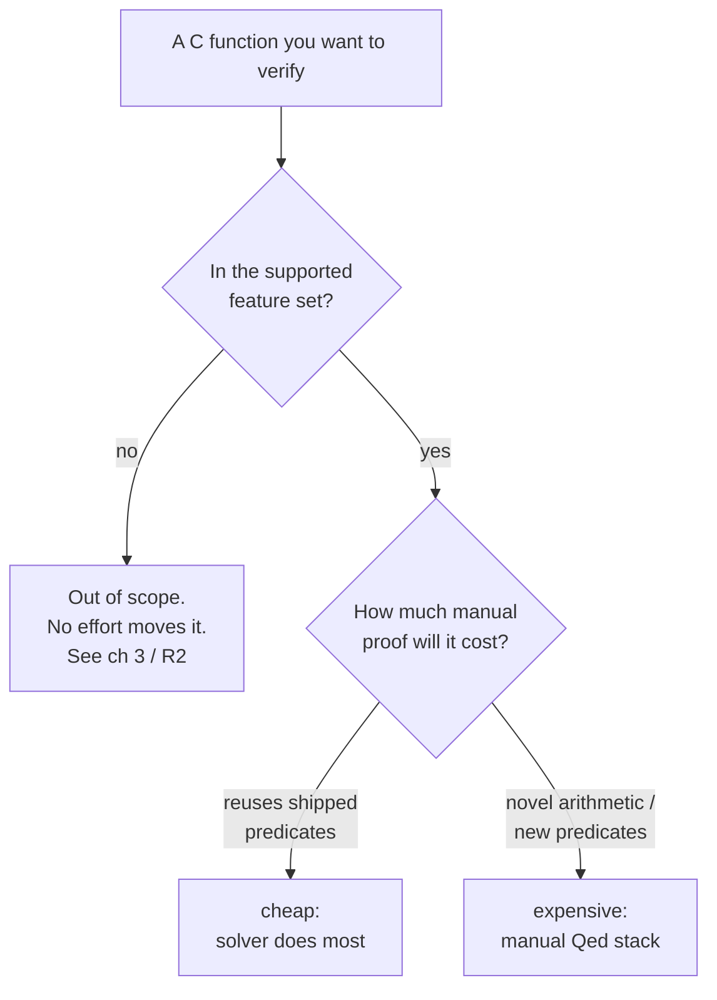

# Scope & scaling in depth

[ch 3](ch03-scope-at-a-glance.md) answers "can QCP handle code *like* mine?" in one glance. This chapter answers the two questions that come next: *what will it cost me?* and *will it still hold up when my codebase is large?* If you are sizing a verification effort — budgeting hours, deciding which modules to prove first, estimating the manual-proof tax — this is the chapter to read before you commit.

The frame to carry through: **scope is two axes, not one.**

- **Feature coverage is binary.** A C construct is either in the model or it isn't. Floats, `goto`, function pointers, and shared-memory concurrency are out; everything else in the [matrix](reference/SUPPORT_MATRIX.md) is in. No amount of effort moves a feature across this line — it's a property of the Rocq value/AST/memory model, not of how hard you try.
- **Effort cost is continuous.** *Inside* the supported set, the cost of verifying a function ranges from nearly free (the strategy solver discharges everything) to substantial (you write a stack of manual `Qed` proofs). This axis is where your budget actually goes, and it's the one ch 3 doesn't quantify.

Read this chapter for the second axis. For the first — the yes/no verdicts and their evidence — stay with [ch 3](ch03-scope-at-a-glance.md) and the full [support matrix (R2)](reference/SUPPORT_MATRIX.md).



*The two axes: coverage is the binary gate (left); effort is the continuous cost that only applies once you're through it (right).*

## The effort axis, measured

Manual proof is a **minority but real** share of the work. The strategy solver discharges the routine entailments automatically; you (or the LLM you direct) write the rest. The honest headline, the one to quote when someone asks "how much is automated":

> **Roughly a quarter to a third of proof effort is manual, on average.**

That range — not a single percentage — is deliberate. The exact ratio depends on **what you count and over what scope**, and the example proofs are **regenerated artifacts** whose counts drift every time the corpus is re-run (they shifted measurably even while this manual was being written). So the rule is **command-first**: cite the measurement, treat the number as an approximate snapshot, and re-run before you rely on it.

Three ways to count, all from the repo root, all snapshots:

```bash
# Auto VCs the solver discharged (one Admitted lemma each):
grep -rh "Admitted" SeparationLogic/examples --include="*_proof_auto.v"    | wc -l   # ≈ 4350

# Manual Qed lemmas, counting the sharded part-files too (see "scaling" below):
grep -rh "Qed"      SeparationLogic/examples --include="*_proof_manual*.v" | wc -l   # ≈ 1770

# Manual Qed lemmas, umbrella files only (ignores the shards):
grep -rh "Qed"      SeparationLogic/examples --include="*_proof_manual.v"  | wc -l   # ≈ 1490
```

| Counting method | Auto : Manual | ≈ % manual |
|---|---|---|
| Lemma count, **shard-aware** (≈ 4350 auto / ≈ 1770 manual `Qed`) | **≈ 2.5 : 1** | **≈ 29%** |
| Lemma count, **umbrella files only** (≈ 4350 / ≈ 1490) | **≈ 3.0 : 1** | **≈ 25%** |
| `scripts/collect_and_analyze.py` paired methodology (re-run it; see below — it emits its own number, don't quote a frozen one) | ≈ 3 : 1 | run-to-measure |

The three rows disagree by design — they measure different populations. The shard-aware count includes the hand-split part-files of large proofs (next section), so it credits more manual effort; the umbrella count ignores them. The benchmark script (`scripts/collect_and_analyze.py`) re-runs the whole pipeline (it shells out to `make`/`symexec` with timing) and counts lemma *stubs*, including any `Admitted`, rather than `Qed`s — a different population again. Run it **from the repo root, in a writable checkout** (it writes `examples_strategies_stats.{json,py,csv}` and friends into the working directory):

```bash
# from the repo root, in a writable checkout:
python3 scripts/collect_and_analyze.py
```

**Don't quote a frozen script number as fact** — re-run and read off its current output. The honest headline to carry away is the range (a quarter to a third), not any one row's percentage.

> **Note:** raw `Qed` is a proof-*effort* proxy, not a verification-condition count. It also counts helper lemmas, not only per-VC obligations. Use it to gauge how much hand-proving a corpus represents, not to claim "*N* VCs were proved."

### What the global ratio does — and doesn't — tell you

The **global** ≈ 2.5–3 : 1 split is solid: it's a direct count over the whole shipped corpus. The **per-category** breakdown is weaker evidence — medium confidence, estimated from how categories of code behave, not reproduced by a single command. State it as a tendency, and label it as such:

- **Cheaper** (less manual): array, string, list, and algorithmic code that **reuses shipped predicates** (`IntArray::full/seg/undef`, `store_string`, `sll`, …). The library already carries the lemmas; the solver closes most VCs. A shard-aware count finds roughly **1 in 9** measured cases hits **zero** manual `Qed` lemmas — these ride entirely on shipped automation. *Denominator and counting scope:* one "case" per umbrella `*_proof_manual.v` (≈ 120 of them at this snapshot); a case counts as zero-manual when its umbrella **plus any shard part-files** carry no `Qed`. At baseline that was **≈ 13 / 120 ≈ 1 in 9** — re-measure, the tree regenerates:

  ```bash
  # zero-manual-Qed cases / total cases (shard-aware), from the repo root:
  t=0; z=0
  for f in $(find SeparationLogic/examples -name '*_proof_manual.v'); do
    t=$((t+1)); stem=$(basename "$f" _proof_manual.v); d=$(dirname "$f")
    [ "$(grep -rh Qed "$d" --include="${stem}_proof_manual*.v" | wc -l)" -eq 0 ] && z=$((z+1))
  done; echo "$z / $t"
  ```
- **Pricier** (more manual): arithmetic / number-theory code and OS / **STS** — state-transition-system — state-machine code, where the properties are novel and there's no off-the-shelf predicate to lean on.

> **Honest limit:** the global ratio is a count; the per-category skew is a qualitative estimate. Plan with the global ≈ a-quarter-to-a-third figure; treat "arrays are cheaper than bignum" as a useful rule of thumb, not a measured guarantee.

### The one cost that never automates away

There is a manual tax you pay on **every** integer result, regardless of category: **range and overflow bounding.** In QCP annotations, `Z` is an **unbounded mathematical integer**, not a fixed-width C `int`. There is no overflow automation — so each `Z` arithmetic VC carries a manual range/overflow bound that *you* state. This is exactly why the simplest arithmetic example in the corpus, `QCP_examples/QCP_demos_human/simple_arith/abs.c`, opens by re-imposing C bounds by hand:

```c
/*@ Extern Rocq (Zabs: Z -> Z) */
/*@ Require INT_MIN < x && x <= INT_MAX && emp
    Ensure  __return == Zabs(x) && emp */
```

Every time you say "automated" about integer code, remember this bound rides along. It's the floor under the effort axis: even a corpus full of reused predicates still pays the overflow tax per integer VC.

> 🟢 **Tier 1** — You write the bound in the spec (`INT_MIN < x && x <= INT_MAX`); you don't prove it by hand — the solver usually discharges the resulting VC. The cost to you is *remembering to state it*, not proving it.

> 🔵 **Tier 2** — When an arithmetic VC goes red, a missing range bound is the first thing to check: the goal is true over `Z` but the proof needs the `int` window you forgot to assert.

## Scaling: contracts as the seam

QCP scales the way well-factored C scales — **one function at a time, through its contract.** Symbolic execution instantiates the *callee's* contract at each call site rather than re-entering the body (see [ch 9](ch09-goals-symexec-and-proof.md) for the mechanics); the consequence for scale is that **proof effort is additive and local, not combinatorial.** Verifying a 200-function module costs roughly the sum of 200 per-function efforts, not a whole-program proof. Prove the leaves, then the callers; a verified function never has to be re-verified when a new caller appears, as long as its contract holds.

Two facilities make this **multi-file modularity** work — the seam that keeps scaling additive:

- **Shared contracts in `_def.h` headers.** A **representation predicate** (the ownership predicate describing a structure's memory layout — see [glossary](reference/GLOSSARY.md)) and the contracts that use it live in a header (e.g. `QCP_examples/QCP_demos_human/bst_def.h`, `int_array_def.h`, `poly_sll_def.h`), included by every `.c` that touches that structure. One definition, many callers — the modular seam is a real, shipped pattern, not an aspiration.
- **`Import Rocq` / `Extern Rocq` to bind the Rocq side.** These pull the Rocq-level predicate definitions and lemmas into a case so its contracts typecheck (≈ 485 `Extern Rocq` and ≈ 184 `Import Rocq` occurrences across the corpus C/headers). This is the mechanism by which a predicate defined once is reused everywhere.

**Predicate polymorphism** sharpens the leverage. A single generic list spec covers any struct/field shape — `super_poly_sll2` (used in `Applications_human/cnf_trans/` and `alpha_equiv/`) is one list contract reused across unrelated data types. You write the spec once; it scales across the codebase without per-type duplication. This is one of QCP's most **under-sold** capabilities; for the full list of under-sold capabilities, see [ch 3](ch03-scope-at-a-glance.md) and the [support matrix (R2)](reference/SUPPORT_MATRIX.md).

> 🟣 **Tier 3** — The seam is also where you extend the library: a new representation predicate plus a `.strategies` rule lets the solver discharge the recurring obligations for future callers *when the rule covers the pattern*, shifting that work from the manual axis to the auto axis. It's the highest-leverage move on the effort axis — though a rule only ever covers the cases it matches, so novel obligations still land on you; see [ch 14](ch14-extension.md).

## Sharding: proofs at production scale

Some functions generate more manual proof than fits comfortably in one file. The corpus handles this by **sharding** the human-editable proof: the single `*_proof_manual.v` is hand-split into numbered part-files, and an umbrella `*_proof_manual.v` `Require`s and `Include`s the parts in order. The build wiring lives in the `.depend.*` files; **`symexec` is unaware of the shards** — `--proof-manual-file` still points at the single umbrella, and the warning that the manual file "was not updated" on regeneration is normal and protective (it never clobbers your hand-written proofs).

The flagship is **`minigmp`** — a GMP-style bignum arithmetic library, the production-scale, credibility bookend of the example ladder (the corpus section below). Its manual proof is split into six parts:

```bash
ls SeparationLogic/examples/Applications_human/minigmp/gmp_proof_manual_part*.v   # part1 … part6
```

```coq
(* gmp_proof_manual.v — the umbrella *)
From SimpleC.EE.Applications_human.minigmp Require Import gmp_proof_manual_part1.
...
From SimpleC.EE.Applications_human.minigmp Require Import gmp_proof_manual_part6.
Include gmp_proof_manual_part1.
...
Include gmp_proof_manual_part6.
```

Note what the numbers say about scaling. For `minigmp` the split is roughly **225 auto `Admitted` / 117 manual `Qed`** (shard-aware; re-measure) — so even at production scale, on hard bignum arithmetic, the solver still carries the larger share, and the manual fraction sits near the corpus-wide tendency rather than exploding. Sharding is what keeps that manual fraction *editable* when it's large; it does not change the ratio.

> **Note:** the shard *naming* is not uniform. `minigmp` and `minigmp_sumlib` use the `_partN` pattern (`gmp_proof_manual_part1.v … _part6.v`); `cnf_trans` uses a bare-number `…manualN` pattern (`cnf_trans_proof_manual1.v … 3.v`). Don't assume one convention, and don't assume every manual proof is a single file — check the directory.

A practical corollary for trust: because sharded part-files are still `*_proof_manual*.v`, a leftover-`Admitted` audit must glob the parts, not only the umbrella —

```bash
grep -rl "Admitted" SeparationLogic/examples --include="*_proof_manual*.v"
```

Run this per checkout: an `Admitted`-free manual file is a **convention, not a guarantee** (a no-invariant benchmark case has shipped with stubs), so audit rather than assume. The trustworthy unit is a `Qed`, never a file — the [full trust story is ch 10](ch10-trust-and-soundness.md).

## The corpus, as a sense of reach

The shipped corpus is the concrete evidence of what QCP scales to. Five subtrees (`.c` counts per FACTS §F7, re-verified live — snapshot):

| Subtree | `.c` | What it shows about scale |
|---|---:|---|
| `Applications_human/` | 26 | Production scale: `minigmp` bignum, `LiteOS` (17 RTOS kernel ops), `cnf_trans` (SAT), `alpha_equiv` (λ-calculus), `typeinfer`, `fme` |
| `QCP_demos_human/` | 33 | The teaching set; best-practice hand annotations |
| `QCP_demos_LLM/` | 38 | The same demos re-annotated for LLM workflows (plus 5 LLM-only cases — `array_cases`, `array_cases_noinv`, `sortArray2`, `sortArray3`, `union_find_err_rel` — hence the spread over `QCP_demos_human`'s 33; `comm -23` the two basename lists to confirm); the agent workflow's canonical reference |
| `LLM_bench/` | 23 | Benchmark for LLM-generated specs/proofs |
| `stdlib/` | 0 | Shared `string.h` + `string.strategies` |

The takeaway is not the totals but the *spread*: from one-line arithmetic up through a sharded bignum library, the same pipeline carries the whole ladder.

## What to take away

- **Scope is two axes.** Feature coverage is binary (the [ch 3](ch03-scope-at-a-glance.md) gate); effort cost is continuous (this chapter). Budget against the second only once you're past the first.
- **Plan for roughly a quarter to a third manual proof, on average** — but remember *manual* means "needs a written Rocq proof," not "you write it": with the AI dial up the LLM drafts that fraction, so a tier-1 reader's hands-on share is the smaller residual it can't close. Always cite the *command*, never a frozen number, because the example proofs regenerate. The global ratio is solid; the per-category skew (arrays cheap, arithmetic/OS pricier) is a medium-confidence rule of thumb.
- **Every integer result pays a manual range/overflow bound.** `Z` is unbounded; there is no overflow automation.
- **QCP scales through contracts.** Effort is additive and local; shared `_def.h` contracts and predicate polymorphism keep it from becoming combinatorial. Large proofs **shard** into part-files (`minigmp`, six parts) to stay editable — the ratio holds at scale.
- **Audit `Admitted` per checkout** (glob the shards), and remember the trustworthy unit is a `Qed`, not a file — see [ch 10](ch10-trust-and-soundness.md).

For the at-a-glance verdicts and the not-supported box, return to [ch 3](ch03-scope-at-a-glance.md). For the full feature matrix with evidence provenance and the effort calibration table, see [the support matrix (R2)](reference/SUPPORT_MATRIX.md). For the limits stated plainly — including the float silent-half-stub edge — see [ch 13](ch13-honest-limits.md).
