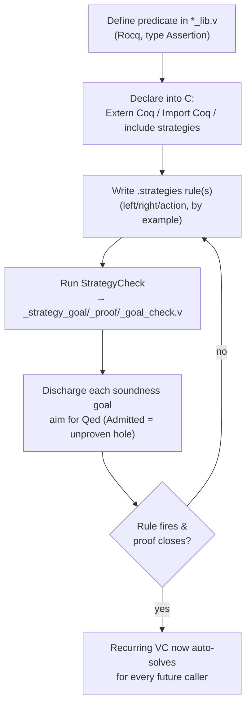

# Extension — new predicates & strategies

This is the manual's most advanced chapter, and the one with the biggest caveat up front. Extending QCP — teaching it a new ownership shape and the automation to reason about it — is a 🟣 **tier-3** task: you write Rocq (formerly Coq), you read separation logic, you run the proof assistant by hand. The body below assumes that comfort and does not re-teach it.

> **Note:** Read this as intended-workflow, by-example. The dedicated strategy-authoring tutorial (T7) is **not written yet**. There is no published reference for the `.strategies` rule language. So this chapter does not give you a grammar — it shows you the moves *by example*, grounded in the real shipped `.strategies` files and the real soundness proofs beside them. Every form below is quoted from a file in the repo; **nothing here is invented syntax**. When T7 lands it will be the authoritative source; until then, your best reference is the corpus itself (start with `QCP_examples/QCP_demos_human/sll.strategies`, `int_array.strategies`, and `bst.strategies`).

## Why extend at all

The reason to do this work is leverage. QCP's automation is **driven by a strategy library**, and that library is *the* reason most **verification conditions** (a VC is an entailment `P |-- Q` that `symexec` emits for one step of your annotated code; see [R4 — Glossary](reference/GLOSSARY.md)) land in the automatic file rather than on you — the auto:manual balance the manual keeps citing (for command-first, snapshot-qualified counts see [ch 12](ch12-scope-and-scaling.md)). A strategy rule encodes "when you see *this* spatial pattern on the left and *that* one on the right, here is how to cancel them." Every rule that matches a recurring obligation turns a VC that *would* have landed in `*_proof_manual.v` — a Rocq proof you or the LLM must write — into one the solver discharges into `*_proof_auto.v` automatically.

The payoff compounds. A `.strategies` rule you add for your predicate works **for every future caller**, not only the function in front of you. If your codebase manipulates a custom data structure in dozens of functions, one good fold/unfold rule pair can move that structure's bookkeeping off the manual axis for all of them at once.

> **Honest limit:** a rule only ever covers the patterns it matches. Adding strategies shrinks the manual fraction for the obligations your rules anticipate; genuinely novel obligations still land on you. This is the highest-leverage move on the effort axis, not a way to drive the manual fraction to zero.

The work has three parts, in order: **define the predicate** in Rocq and declare it into C, **write the strategy rule(s)**, then **discharge the per-rule soundness obligation** that `StrategyCheck` emits. The rest of this chapter walks each.

## Step 1 — define a representation predicate

A representation predicate is a Rocq function returning `Assertion` — a separation-logic description of the memory a value occupies. You write it in a `*_lib.v` file. The canonical specimen is `sll` (singly-linked list), defined in `SeparationLogic/examples/QCP_demos_human/sll_lib.v`:

```coq
Fixpoint sll (x: addr) (l: list Z): Assertion :=
  match l with
    | nil     => “ x = NULL ” && emp
    | a :: l0 => “ x <> NULL ” &&
                 EX y: addr,
                   &(x # "list" ->ₛ "data") # Int |-> a **
                   &(x # "list" ->ₛ "next") # Ptr |-> y **
                   sll y l0
  end.
```

If the `**`/`emp`/`“ … ”` notation reads as foreign, a refresher first will help: [ch 8](ch08-separation-logic-memory-model.md) and [T1](../tutorial/T1-representation-predicates.md) / [T4](../tutorial/T4-symbolic-execution.md) cover the memory model this chapter builds on. Read `sll` as a memory shape: `nil` owns no heap; a `cons` owns the `data` and `next` cells plus the recursive sub-list, all separated by `**`.

Once the predicate is defined in Rocq, you make it usable from C annotations with an `Extern Coq` declaration in your shared header. From `QCP_examples/QCP_demos_human/sll_def.h`:

```c
/*@ Extern Coq (sll : Z -> list Z -> Assertion)
               (sllseg: Z -> Z -> list Z -> Assertion)
               (sllbseg: Z -> Z -> list Z -> Assertion)
 */

/*@ Import Coq Require Import SimpleC.EE.QCP_demos_human.sll_lib */

/*@ include strategies "sll.strategies" */
```

Three annotations, three jobs: `Extern Coq` declares the predicate's name and type so you can write `sll(p, l)` in a `Require`/`Ensure`; `Import Coq` pulls in the `*_lib.v` that defines it; `include strategies` wires in the rule file you write in Step 2. The keyword is literally `Extern Coq` — note the token stays spelled `Coq` even though the proof assistant is now Rocq. This declaration surface is [ch 6](ch06-annotations-as-specs.md)'s subject and the [bestiary (R1)](reference/BESTIARY.md)'s; do not re-derive it here — Step 1 is "define it, declare it," and you already know how to declare.

## Step 2 — write a `.strategies` rule

A `.strategies` file is a list of numbered rules. Each rule is a pattern over the **entailment** the solver is trying to close — facts on the `left` (what you have) and the `right` (what you must show) — plus an `action` that rewrites the goal when the pattern matches. The whole point is to cancel a spatial predicate on both sides, or to unfold/fold one into its definition, so the solver makes progress without a hand-written proof.

Here is a real, verified rule from `QCP_examples/QCP_demos_human/sll.strategies` — id 6, which cancels an `sll` against an `sll` at the same head pointer:

```text
id : 6
priority : core(0)
left : sll(?p, cons{Z}(?x0, ?l0)) at 0
right : sll(p, cons{Z}(?x1, ?l1)) at 1
action : left_erase(0);
         right_erase(1);
         right_add(x0 == x1);
         right_add(l0 == l1);
```

Read it operationally. The `?`-prefixed names are pattern variables the matcher binds (`?p`, `?x0`, …); a bare name (`p` in the `right` line) must match the value already bound on the `left`. When the solver sees a non-empty `sll` on each side at the same head, the action **erases both** spatial facts (`left_erase(0)` / `right_erase(1)` — the indices are the `at N` slots) and **adds** the residual pure obligations to the right: the heads are equal (`x0 == x1`) and the tails are equal (`l0 == l1`). Two spatial predicates collapse into two ordinary (non-spatial) equalities — one on integers, one on lists — that the solver's pure-reasoning side discharges.

The other moves you will see in the corpus are variations on the same theme. `int_array.strategies` shows the array idiom — pulling a single cell out of a whole-array predicate so an indexed store can be reasoned about, then folding it back. From `QCP_examples/QCP_demos_human/int_array.strategies`, id 1:

```text
id : 1
priority : core(1)
left : IntArray::full(?p, ?n, ?l) at 0
right : store(?p + (?i * sizeof(I32)), I32, ?v) at 1
check : infer(0 <= i);
        infer(i < n);
action : right_erase(1);
         left_erase(0);
         left_add(IntArray::missing_i(p, i, 0, n, l));
         right_add(v == l[i]);
```

This one adds a `check` clause: side conditions (`infer(0 <= i)`, `infer(i < n)`) the solver must establish before the rule fires — here, that the index is in bounds. When it fires, it swaps the full-array predicate for the "all but cell `i`" predicate (`IntArray::missing_i`) and records that the stored value is the array's element at `i`. Its companion rule (`int_array.strategies` id 2) folds the cell back — the same shape in reverse. Not every predicate needs this cell-pull idiom: `bst.strategies` reuses the *same primitive family* (`left_erase`/`right_erase`/`right_add`) on its own tree predicates `store_tree` and `store_ptb`, but as plain same-head cancellation rules — structurally the sll rule 6 above, with no `check : infer` guard.

The other moves you'll meet in the corpus are variations on these: `left_add`/`right_add` add a fact *or a predicate* to the selected side (a pure equality like `x0 == x1`, or a spatial predicate like `IntArray::missing_i` above — pure equalities are just the simplest case), the `left_exist_add`/`right_exist_add` variants introduce existentials, `check : infer(...)` guards a rule, and `priority` controls when a rule is tried. Treat the shipped `.strategies` files as your pattern catalogue; do not extrapolate forms that don't appear there.

> **Warning:** a strategy rule is a rewrite the solver applies *blindly* once it matches — its correctness is not self-evident from the rule text. A wrong rule is caught by its soundness obligation (Step 3) **only if you actually close that obligation with `Qed` and compile it**; a rule whose soundness proof you leave `Admitted` is a trusted hole, exactly like any other admit ([ch 10](ch10-trust-and-soundness.md)). Separately, an over-broad pattern can make the solver loop or rewrite goals into shapes it can't finish. Keep rules tight, give them sensible `priority`, discharge their soundness proofs for real, and lean on the existing rules as templates.

## Step 3 — discharge the strategy-soundness obligation

This is the step that keeps Step 2 honest, and it is where the strategy library plugs into the same two-tier trust model as the rest of QCP ([ch 10](ch10-trust-and-soundness.md)). **Every rule you write becomes a Rocq proof obligation** — you must prove the rewrite is sound, i.e. that the entailment the rule claims actually holds.

`StrategyCheck` generates that obligation. Run it on your `.strategies` file (full flag reference in [R3 — Invocation](reference/INVOCATION.md)):

```bash
linux-binary/StrategyCheck \
  --strategy-folder-path=SeparationLogic/examples/QCP_demos_human/ \
  --coq-logic-path=SimpleC.EE.QCP_demos_human \
  --input-file=QCP_examples/QCP_demos_human/sll.strategies \
  --no-exec-info
```

It emits three analogous strategy artifacts — mirroring the `symexec` VC files, but with no auto/manual split (a strategy proof is one file you fill):

| File | Contents |
|---|---|
| `<name>_strategy_goal.v` | one `Definition` per rule — the soundness goal as a separation-logic entailment |
| `<name>_strategy_proof.v` | one `…_correctness` lemma per rule — **where you write the proof** |
| `<name>_strategy_goal_check.v` | a sealed `Module … : …_Strategy_Correct` `Include`-ing the proof file — the completeness gate |

For sll rule 6 above, `StrategyCheck` turns the rule into a goal `sll_strategy6` in `sll_strategy_goal.v`, and the proof you write lives beside it in `sll_strategy_proof.v` — verified, it reads:

```coq
Lemma sll_strategy6_correctness : sll_strategy6.
  pre_process_default.
  Intros.
  subst.
  entailer!.
Qed.
```

That `Qed` is the point. **A strategy proof that ends in `Qed` is re-elaborated by the Rocq kernel**, exactly like a manual VC. The re-check is not automatic, though: `StrategyCheck` only *writes* the obligation — you (or your Rocq build) must compile it with `coqc`. Compile the completeness gate `_strategy_goal_check.v`: it `Include`s `_strategy_proof.v`, so a green build confirms both that every proof closed *and* that the module satisfies the full `…_Strategy_Correct` interface (compiling `_strategy_proof.v` alone checks the `Qed`s but not the interface). Once that `coqc` compile succeeds, the rewrite your rule performs is kernel-checked sound. This is strong: it means a *buggy* strategy rule fails here, at proof time, rather than silently corrupting every future auto-solve that uses it.

### The trusted residue — a few rules ship `Admitted`

Most strategy proofs close with `Qed` and are kernel-checked; two shipped files (`string` and `minigmp`) carry a small trusted `Admitted` residue that is **trusted, not proven** — the same trust-the-tool relationship the auto VCs have, and part of QCP's Trusted Computing Base. The exact count and the grep that finds them live in [ch 10](ch10-trust-and-soundness.md), which owns that audit.

The actionable takeaway is narrow: when *you* extend the library, land your own rules in the `Qed` majority. An `Admitted` in a strategy proof you wrote is an unproven hole, and a hole there silently licenses a rewrite the solver will then trust everywhere. Audit your own strategy proofs the same way you audit a manual VC file — the counts and `Print Assumptions` recipes in [ch 10](ch10-trust-and-soundness.md) apply unchanged.

## The extension loop

Putting the three steps together, extending QCP is a tight cycle:



Caption: the predicate-and-strategy extension loop — define, declare, write the rule, prove it sound, and the obligation it covers moves from manual to auto for all future callers.

The reward at the end of the loop is what makes the tier-3 work worth it: a class of obligation that used to demand a hand-written Rocq proof now discharges automatically, library-wide. That is the strategy library doing its job — and the only way to grow it for a data structure QCP doesn't already know.

## What to take away

- **Extending QCP is leverage**: a `.strategies` rule turns a recurring manual VC into an auto one for *every* future caller — the lever behind QCP's auto:manual ratio ([ch 12](ch12-scope-and-scaling.md)).
- **Three steps, in order**: define a Rocq `Assertion` predicate and `Extern Coq`-declare it (declaration surface in [ch 6](ch06-annotations-as-specs.md) and the [bestiary (R1)](reference/BESTIARY.md)); write `.strategies` rule(s) using only the `left`/`right`/`action`/`check` forms the shipped files show; discharge the per-rule soundness goal `StrategyCheck` emits (full flag set in [R3 — Invocation](reference/INVOCATION.md)).
- **Strategy soundness is the same two-tier trust as everything else**: a rule's `…_correctness` lemma is kernel-checked when you compile it and it ends in `Qed`. Most rules do; two shipped files (`string`, `minigmp`) carry a small `Admitted` residue that is trusted, not proven. Land *your* rules in the `Qed` majority, and audit them with the recipes in [ch 10](ch10-trust-and-soundness.md).
- **This chapter is by-example because T7 isn't written**: the corpus `.strategies` files are your reference until it is. Do not invent rule syntax — copy the shape from `sll.strategies`, `int_array.strategies`, `bst.strategies`. When a goal a strategy *should* have closed stays red, [ch 11 — the Stuck-Goal Differential](ch11-stuck-goal-differential.md) cause #4 (automation came up short) is the place to add or sharpen a rule.
